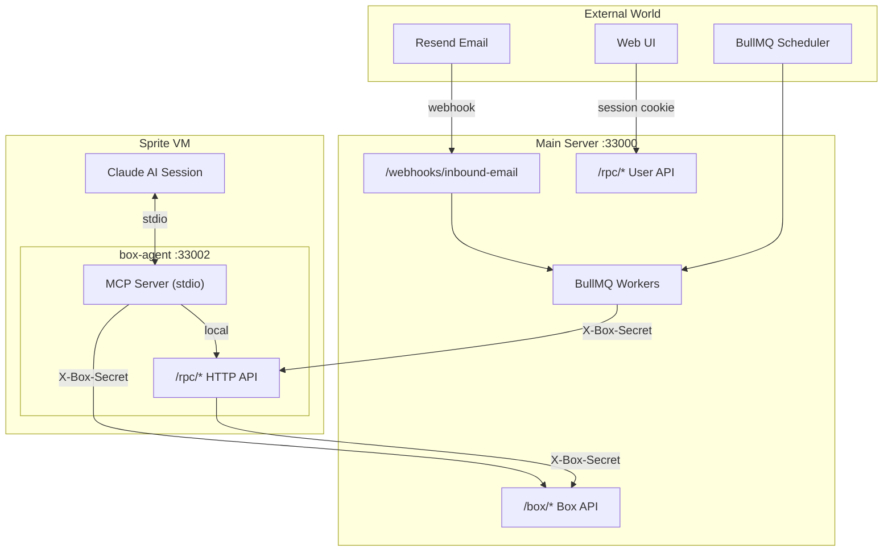
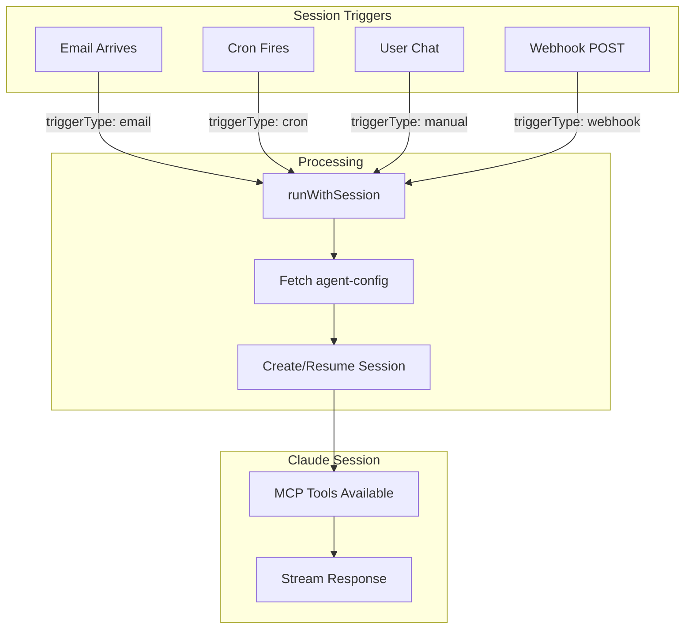
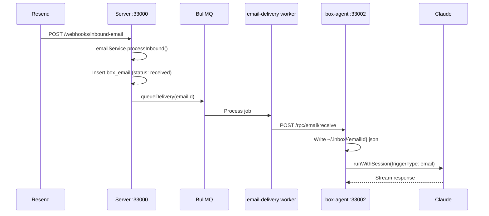
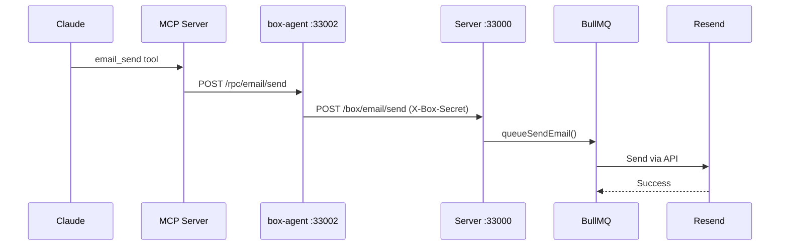
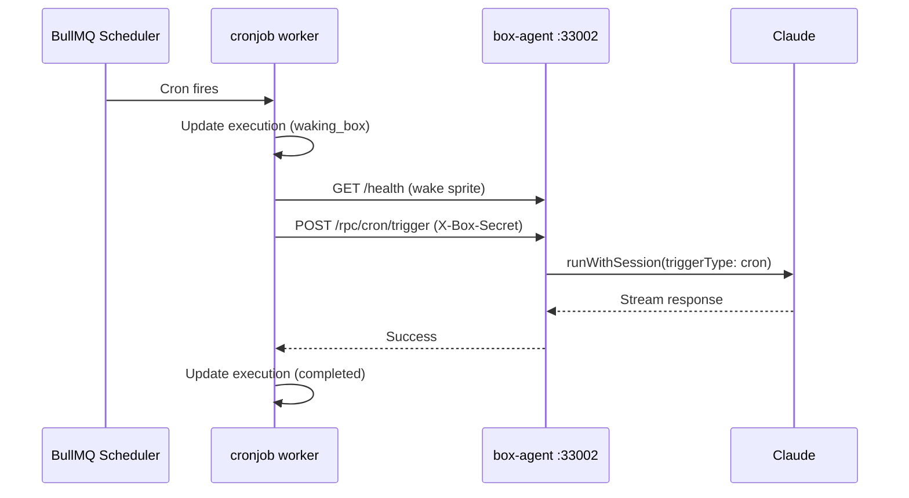
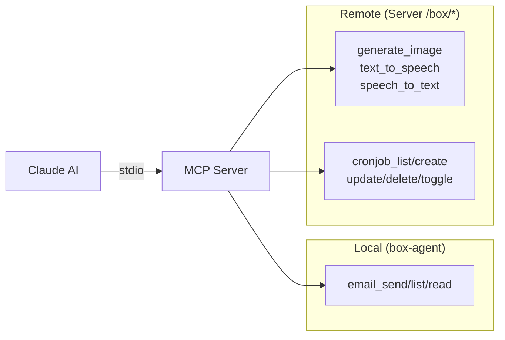

# VPS Claude

Deploy autonomous Claude AI agents in isolated VMs with email, cronjobs, and MCP tools.

## Architecture



## Quick Start

```bash
# Start dependencies
bun run db:start   # Postgres + Redis

# Start development servers
bun run dev        # Server (33000) + Web (33001)
```

## Communication Interfaces

### Session Triggers

All triggers converge at `runWithSession()` which fetches config, creates/resumes Claude session, and streams responses.



| Trigger | Entry Point               | contextType | Status Tracking            |
| ------- | ------------------------- | ----------- | -------------------------- |
| Email   | Webhook → delivery worker | `email`     | box_email.status           |
| Cron    | BullMQ scheduler          | `cron`      | boxCronjobExecution.status |
| Manual  | UI → /rpc/sessions/send   | `chat`      | Session ID only            |
| Webhook | POST /rpc/webhook/trigger | `webhook`   | (future)                   |

### Email Inbound



### Email Outbound



### Cronjobs



### MCP Tool Routing



| Category | Tools                                                | Target               |
| -------- | ---------------------------------------------------- | -------------------- |
| Email    | `email_send`, `email_list`, `email_read`             | Local box-agent      |
| AI       | `generate_image`, `text_to_speech`, `speech_to_text` | Server /box/ai/\*    |
| Cronjob  | `cronjob_list/create/update/delete/toggle`           | Server /box/cronjobs |

## API Layers

| Layer           | Location           | Port  | Auth           | Purpose               |
| --------------- | ------------------ | ----- | -------------- | --------------------- |
| MCP             | box-agent (stdio)  | N/A   | N/A            | Claude ↔ tools bridge |
| Box-Agent API   | box-agent `/rpc/*` | 33002 | X-Box-Secret   | External → box        |
| Server Box API  | server `/box/*`    | 33000 | X-Box-Secret   | Box → backend         |
| Server User API | server `/rpc/*`    | 33000 | Session cookie | User → backend        |

## API Documentation

OpenAPI docs via Scalar UI:

- **Server:** http://localhost:33000/
- **Box-agent:** http://localhost:33002/

## Project Structure

```
apps/
  server/       → Hono API on port 33000
  web/          → Next.js on port 33001
  box-agent/    → In-container agent (runs inside deployed boxes)

packages/
  api/          → ORPC routers, services, workers (BullMQ)
  auth/         → better-auth config
  db/           → Drizzle schema + client (PostgreSQL)
  sprites/      → Sprites (Fly.io) client for VM deployment
  queue/        → BullMQ queue definitions
  email/        → Email client (Resend)
  shared/       → TypeIDs, constants, schemas
```

## Development

See [CLAUDE.md](./CLAUDE.md) for detailed development reference.
